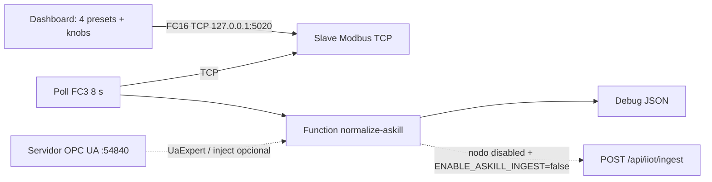

# Askill SIM-LAB — banco de laboratorio IIoT

Banco público para demostrar el **anti-corrupción OT → JSON** del contrato Askill (`POST /api/iiot/ingest`).  
**No es un gateway de planta.** No hay PLC real, la UI **no** hace POST, y **nunca** apunta a `app.askillco.com`.

La Dashboard es mínima: **4 escenarios** + unos knobs. Eso se escribe por **Modbus TCP FC16** a un slave en localhost. Otro flow **lee FC3** (TCP de verdad), una Function arma el JSON de ingest, y el HTTP Request queda **apagado**. OPC UA queda como servidor para UaExpert y un inject de lectura opcional; no hay HMI duplicada.

## Arquitectura



Identidad Askill solo en `.env`. El token **no** viaja en `flows.json`.

## Escenarios (botones)

| Preset | Qué prueba en Askill |
|--------|----------------------|
| Running + OEE | status 1, heartbeat, contadores, `power_kw` |
| Sin `total_count` | OEE deshabilitado (`oee_disabled`); no se inventa `0` |
| Falla + vibración | status 3 + salud |
| 2 `dynamic_variables` | tarjetas dinámicas en la UI IIoT |

Ajuste fino (opcional): status, heartbeat, incluir producción, `total_count`, `power_kw`, una dinámica (`temp_camara_combustion_c`).

## Levantar el banco

```bash
cp .env.example .env
# edita placeholders; deja ENABLE_ASKILL_INGEST=false
docker compose up --build
```

| Superficie | URL / puerto |
|------------|----------------|
| Editor Node-RED | http://localhost:1880 |
| Dashboard | http://localhost:1880/ui |
| Modbus TCP slave | `127.0.0.1:5020` unit 1 |
| OPC UA (optativo) | Desde el host: `opc.tcp://localhost:54840/UA/SIMLAB` |

Paletas: `node-red-dashboard`, `node-red-contrib-modbus`, `node-red-contrib-opcua`.

El poll de **8 s** es siempre Modbus. En la pestaña 2, *OPC UA read una vez* no entra en el ciclo. En el primer arranque `node-opcua` puede loguear avisos de certificado.

## Identidad Askill (config)

| Variable | Rol |
|----------|-----|
| `ASKILL_INGEST_URL` | `https://<staging-o-localhost>/api/iiot/ingest` |
| `ASKILL_GATEWAY_TOKEN` | Bearer `askill_gw_…` (solo env) |
| `ASKILL_ASSET_UUID` | UUID del **Activo** attachado al nodo del gateway `SIM-LAB` |
| `ASKILL_TENANT_ID` | Opcional. Si se omite, Askill usa el tenant de la credencial |
| `ENABLE_ASKILL_INGEST` | `false` por defecto |

`timestamp` lo pone el agente en **ISO-8601 UTC**. Destinos: **staging** o **localhost**.

## Cómo emitir la credencial SIM-LAB en Askill

Tenant con `assets` e `iiot` en `active`/`trial` y membresía IIoT **admin**.

1. Staging o localhost: Activo con ficha CMMS y `lifecycle` `active` o `under_maintenance`. Copia el **UUID**.
2. `/{slug}/iiot/gateways` → código **`SIM-LAB`**.
3. `/{slug}/iiot/nodos` → attach al UUID (`telemetry_active`).
4. **Emitir credencial** (se muestra una vez, `askill_gw_…`).
5. `.env`: token + `ASKILL_ASSET_UUID`. Ingest local típico: `http://host.docker.internal:3000/api/iiot/ingest`.

## Mapa Modbus (Holding, unit 1, 0-based)

Enteros `uint32` y `float32` **big-endian IEEE-754 (ABCD)**. HR2 = flags de presencia (bit apagado → el campo **no** va en el JSON).

| Addr | Words | Campo |
|------|-------|--------|
| 0 | 1 | `machine_status` 0–3 |
| 1 | 1 | `heartbeat` 0/1 |
| 2 | 1 | flags |
| 3 | 1 | reserved |
| 4–5 | 2 | `total_count` |
| 6–7 | 2 | `good_count` |
| 8–9 | 2 | `reject_count` |
| 10–11 | 2 | `power_kw` |
| 12–13 | 2 | `consumption_kwh` |
| 14–15 | 2 | `vibration_rms_mm_s` |
| 16–17 | 2 | `temperature_bearing_c` |
| 18–25 | 8 | dyn0–3 valores |

Flags: bit0 total, bit1 good, bit2 reject, bit3 power, bit4 kWh, bit5 vibración, bit6 temp, bit7–10 dyn0–3.

Codec: [`nodered/lab/modbus-codec.js`](nodered/lab/modbus-codec.js).  
Presets: [`nodered/lab/presets.js`](nodered/lab/presets.js).  
Normalizador: [`nodered/lab/normalize-askill.js`](nodered/lab/normalize-askill.js).

Para ingest real: habilita el nodo HTTP en el editor, `ENABLE_ASKILL_INGEST=true`, reinicia. El SaaS enforcea cupo y attach.

## Repo

- `docker-compose.yml` + `nodered/Dockerfile`
- `nodered/flows.json` — presets, Modbus TCP, poll, normalizador, HTTP off
- Regenerar flows: `python3 scripts/gen-flows.py`
